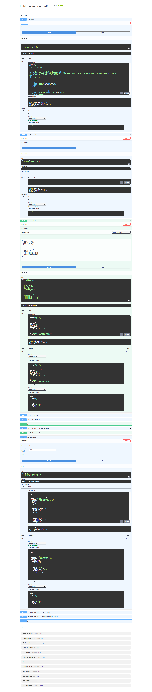

# LLM Evaluation Platform

Production-style evaluation and observability service for RAG and LLM applications.

## Dashboard Preview



Live dashboard: `http://127.0.0.1:8004/` · [GitHub Repo](https://github.com/jawadparvez37-boop/llm-eval-platform)

## Why this project

LLM teams need the same rigor as backend teams: golden datasets, regression checks, latency/token traces, and quality metrics before release. This platform packages those workflows behind a FastAPI service.

## Features

- Golden dataset management for Q&A regression tests
- Batch evaluation runner with per-question scoring
- Metrics: faithfulness, answer relevance, context precision, pass rate
- LLM-as-judge scoring (OpenAI) with heuristic fallback
- Request trace logging (latency, tokens, model, status)
- Reference RAG pipeline for end-to-end demos
- Web dashboard for client demos and screenshots
- SQLite persistence by default (PostgreSQL optional via Docker)

## Stack

- FastAPI, Pydantic, PostgreSQL
- OpenAI (generation + judge)
- Pytest

## Setup

```bash
cp .env.example .env
python -m venv .venv
.venv\Scripts\activate
pip install -r requirements.txt
python scripts/seed_datasets.py
python scripts/run_evaluation.py
python -m uvicorn app.main:app --reload --port 8004
```

Docker is optional. Local development uses SQLite (`eval_platform.db`) by default.

### Optional PostgreSQL

```bash
docker compose up -d
```

Set `DATABASE_PATH` only for SQLite. PostgreSQL support is not required for local demos.

## API

| Method | Path | Description |
|--------|------|-------------|
| GET | `/health` | Health check |
| POST | `/datasets` | Create golden dataset |
| GET | `/datasets` | List datasets |
| POST | `/evaluations/run` | Execute evaluation run |
| GET | `/evaluations/{run_id}` | Fetch run details |
| GET | `/evaluations/{run_id}/summary` | Aggregate metrics |
| POST | `/traces` | Store LLM trace event |
| GET | `/traces` | Query traces |
| GET | `/metrics/overview` | Dashboard summary |

Open dashboard:

```
http://127.0.0.1:8004/
```

API docs remain available at `/docs`.

### Run evaluation

```bash
curl -X POST http://localhost:8004/evaluations/run \
  -H "Content-Type: application/json" \
  -d '{"dataset_id":"<dataset-id>","run_name":"nightly-regression","use_llm_judge":true}'
```

## Layout

```
app/
  main.py                 API routes + dashboard
  static/                 Web UI (HTML/CSS/JS)
  db.py                   SQLite storage
docs/images/              README screenshots
```

## Notes

- Set `OPENAI_API_KEY` to enable generation and LLM judge scoring.
- Without an API key, the reference pipeline and heuristics still run for local demos.
